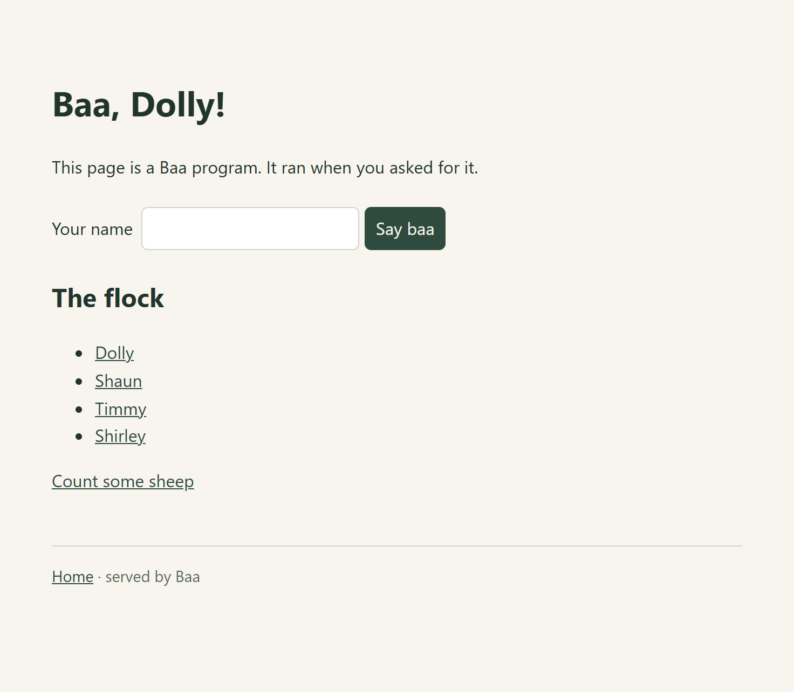
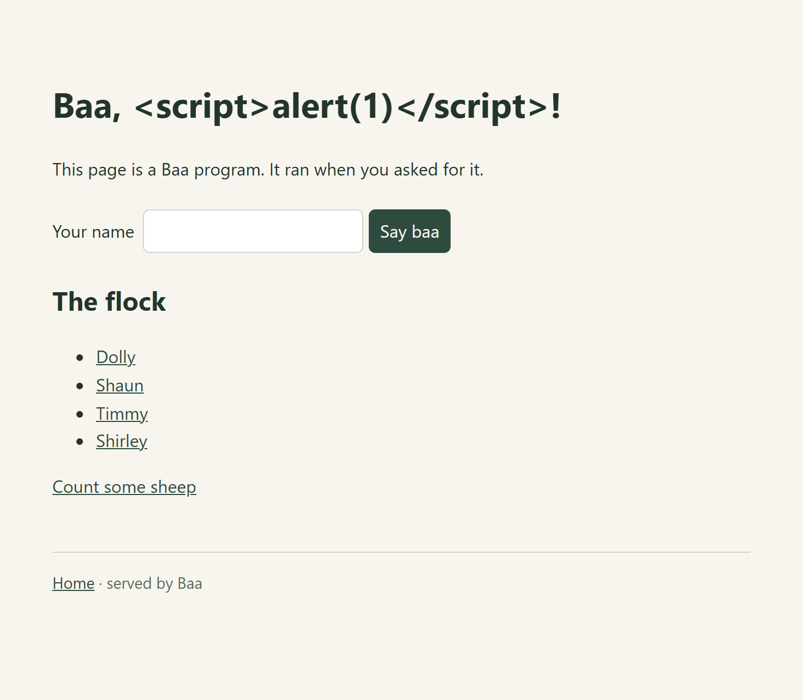

# A website written in Baa

Four `.baa` files that answer HTTP requests. No framework, no build step, no
JavaScript on the page. Each file is an ordinary Baa program: it runs when
somebody asks for the URL, and what it writes to standard output is the reply.



That is a real browser rendering `index.baa`, with `?name=Dolly` in the URL.

## See it running

**<https://sheep.grimtech.co.uk/baa/index.baa>**

These files, on ordinary cPanel shared hosting, executed per request over CGI.
No daemon, no port, no reverse proxy. How it is deployed, and the three things
that are easy to get wrong, are in [docs/web.md](../../docs/web.md).

## Run it

```sh
baa serve examples/site
```

Then open <http://localhost:8080/>. Edit a file and refresh: every request runs
the file again, so there is nothing to restart.

The home page also lists any applications published beside it, discovered by
looking for `apps/*/index.baa` rather than from a list somebody has to keep up
to date. The calculator is the first.

| URL | What it shows |
| --- | --- |
| `/` | The home page. Submit the form to pass a query string |
| `/?name=Dolly` | A query parameter reaching the page |
| `/sheep/Shaun` | One file serving a whole subtree, through `gate.path()` |
| `/sheep/Nobody` | A real 404, set by the page with `gate.status(404)` |
| `/count` | A form. `POST` it; try `abc` to get a 400 back |

## The files

| File | What it does |
| --- | --- |
| [`index.baa`](index.baa) | The home page: reads the query string, builds a list |
| [`sheep.baa`](sheep.baa) | Serves `/sheep/<name>`, using the path below the script |
| [`count.baa`](count.baa) | Reads a posted form, validates it, answers with a status code |
| [`layout.baa`](layout.baa) | The shared page shell, imported by the other three |
| `style.css` | Served as a plain static file |

`layout.baa` is the point worth noticing: a page is a module like any other, so
the parts of a site that repeat are just functions you `export`.

## Escaping is not optional

`name` comes out of the query string, which means it is the visitor's text.
Putting it into HTML unescaped is how a page gets a cross-site scripting hole
in its first line.

`gate.format` and `gate.fill` escape every value they put into a `%s`, which is
the only reason they exist:

```baa
gate.format("<h1>Baa, %s!</h1>", name)
```

Ask for `/?name=<script>alert(1)</script>` and you get this:



**That screenshot is the feature, not a bug.** The payload is drawn as text.
No dialog, and no `<script>` element in the document: the browser never parsed
one. A page that had got this wrong would show nothing there at all, because
the browser would have run the script instead of displaying it.

`gate.html` sends what you give it untouched, for markup you built yourself;
anything that came from the request goes through `gate.format`, `gate.fill` or
`wool.escape_html`.

### Escaping is not the same as a safe link

`escape_html` makes a value safe to *display*. It does nothing about where a
link *goes*, because there is nothing in `javascript:alert(1)` for it to
escape:

```baa
gate.format("<a href=\"%s\">click</a>", "javascript:alert(1)")
// <a href="javascript:alert(1)">click</a>   still runs when clicked
```

A URL that came from a request needs its scheme checked as well:

```baa
gate.format("<a href=\"%s\">click</a>", gate.safe_url(url))
// <a href="#">click</a>
```

`wool.safe_url` returns `nil` for anything that is not relative, `http`,
`https`, `mailto`, `tel` or `ftp`; `gate.safe_url` substitutes `"#"` instead.
Whitespace and control characters are stripped before the scheme is read, so
`java&#9;script:` does not slip past.

Both screenshots above are generated by `tools/shoot-site.ts`, which drives
Chrome, so they cannot quietly stop matching these pages.

## How it works

The protocol is CGI. A Baa program is a short-lived synchronous process that
reads its environment, reads standard input and writes standard output, which
is exactly the shape CGI asks for. `gate` is a reading of things Baa could
already do rather than a new capability: nothing in it opens a socket.

That means `baa serve` and a real web server run the page identically. `baa
serve` sets the same environment variables Apache would and parses the same
reply, so it is a preview rather than a simulation.

## Putting it on a real host

`baa serve` is a development server: one process per request, no concurrency
worth the name, and it binds to localhost. Do not put it on the internet.

These files are running on ordinary cPanel shared hosting at
**<https://sheep.grimtech.co.uk/baa/index.baa>**, which is where the procedure
below comes from. It was previously written from the CGI specification and had
never been run; doing it for real found five bugs, so the account of it now
lives in one place rather than being repeated here.

**[docs/web.md](../../docs/web.md)** has the whole of it: the handler, the
wrapper and why one is needed, the shebang, the permissions, how links have to
be written so a site survives being mounted in a subdirectory, and a table of
symptoms for when it does not work.

The short version, which `tools/build-cgi.ts` does for you:

```sh
BAA_CGI_BIN=$(dirname $(which baa)) BAA_CGI_DIR=/home/you/public_html/example.com/baa node tools/build-cgi.ts
```

Upload the resulting `website/baa/`, `chmod 755 *.baa baa-cgi`, and open
`probe.baa` before anything else. It answers the question worth asking first,
which is whether the server ran a Baa program at all.

The one thing worth repeating here, because it is the part that looks like a
bug in your page and is not: `baa` is itself a Node script beginning
`#!/usr/bin/env node`. A page whose shebang names it needs `node` on the `PATH`
that CGI provides, and CGI does not provide one. The result is a page that runs
perfectly from a terminal and returns 500 in a browser. The generated wrapper
exists to set that `PATH`.

## What this example does not do

No sessions, no cookies being set, no database, no file uploads
(`multipart/form-data` is not parsed; `gate.body()` gives you the raw bytes if
you want to do it yourself). Nothing here is stateful: each request starts a
fresh process that remembers nothing, which is the simplest thing that can
possibly work and also the reason it scales badly under load.

It is a demonstration that the language can do this, not a framework.
